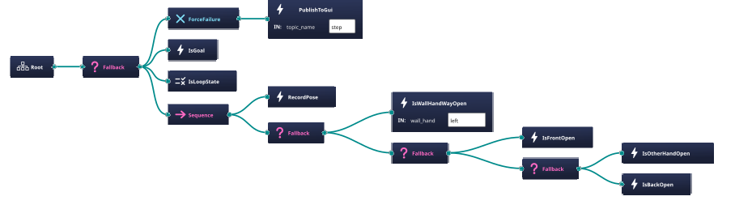

# Behavior Tree Maze Solver With ROS2

this packages contain example of using behavior tree to solve maze and show graphical window for the search process

---

## Screenshots
**maze:**


---

**behavior tree:**
the Is Node check and move the robot




## Usage
```bash
cd behavior-tree-maze-solver-with-ros2
uv sync

colcon build
source install/setup.bash
# launch with maze_size small,big,middle
ros2 launch launcher start.launch.py maze_size:=big
```