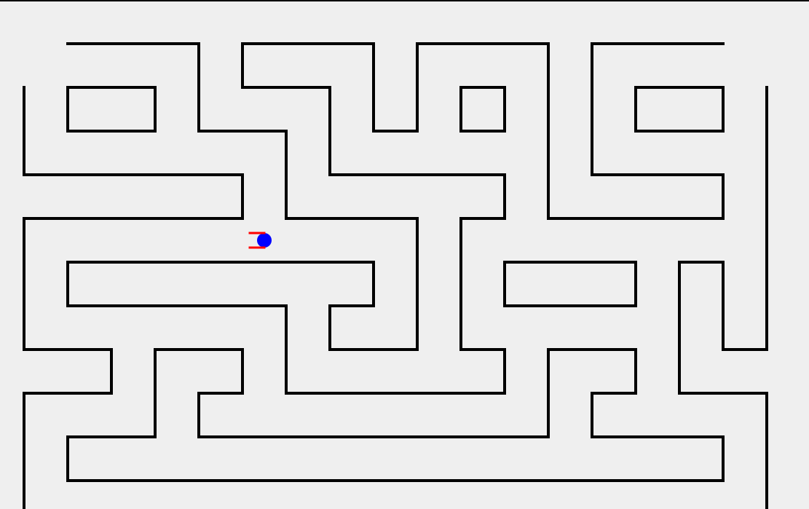
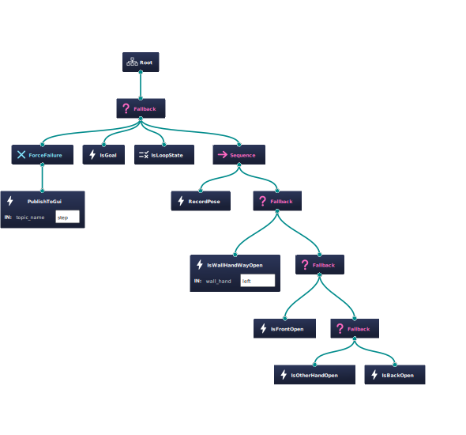

# Behavior Tree Maze Solver With ROS2

these packages contain example of using behavior tree to solve maze by stick one hand with the wall and show graphical pyqt5 window for the search process

---

## Screenshots
**maze:**


---

**behavior tree:**
the "Is**" Nodes check and move the robot




<!--  -->


## Usage
```bash
cd behavior-tree-maze-solver-with-ros2
uv sync

colcon build
source install/setup.bash
# launch with maze_size small,big,middle
ros2 launch launcher start.launch.py maze_size:=big
```
